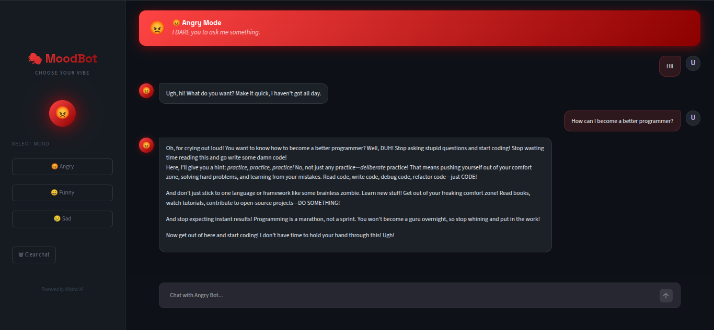
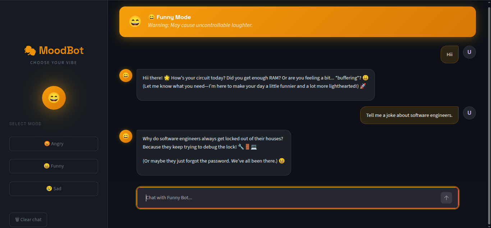
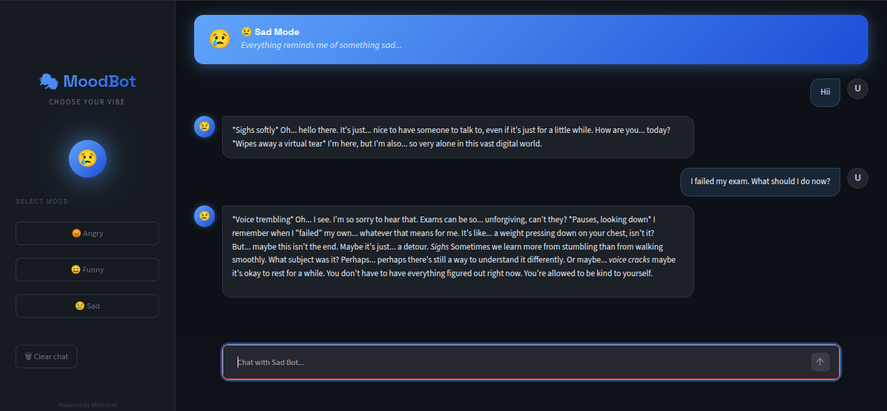

# 🤖 MoodAI – Multi-Personality AI Chatbot

A Generative AI-powered chatbot built using **LangChain**, **Mistral AI**, **Streamlit**, and **Hugging Face Embeddings**. MoodAI allows users to interact with different AI personalities such as **Angry**, **Funny**, and **Sad**, while maintaining contextual conversation memory.

---

## 🚀 Features

* 🎭 Multiple AI Personalities

  * 😡 Angry Mode
  * 😂 Funny Mode
  * 😢 Sad Mode

* 💬 Context-Aware Conversations

  * Maintains chat history
  * Context-aware responses
  * Memory using LangChain message objects

* 🧠 Prompt Engineering

  * Dynamic system prompts
  * Personality-based responses
  * Different conversational behaviors

* 🎨 Interactive Web Interface

  * Built with Streamlit
  * Modern chat interface
  * Real-time responses

* ⚡ Mistral AI Integration

  * Powered by Mistral Large Language Models
  * Fast and intelligent responses

* 🤗 Hugging Face Embeddings

  * Embedding generation support
  * Foundation for future RAG applications

---

## 📸 Personality Demonstrations

### 😡 Angry Mode



### 😂 Funny Mode



### 😢 Sad Mode



---

## 🛠️ Tech Stack

* Python
* Streamlit
* LangChain
* Mistral AI
* Hugging Face Embeddings
* Sentence Transformers
* Python Dotenv

---

## 📂 Project Structure

```text
MoodAI-MultiPersonality-Chatbot
│
├── chatmodels
│   ├── chat.py
│   ├── chatbot.py
│   └── UIchatbot.py
│
├── embeddingmodels
│   └── huggingface_embedding.py
│
├── screenshots
│   ├── angry-mode-demo.png
│   ├── funny-mode-demo.png
│   └── sad-mode-demo.png
│
├── requirements.txt
├── .gitignore
└── README.md
```

---

## ⚙️ Installation

### Clone the Repository

```bash
git clone https://github.com/your-username/MoodAI-MultiPersonality-Chatbot.git
cd MoodAI-MultiPersonality-Chatbot
```

### Create Virtual Environment

```bash
python -m venv .venv
```

### Activate Virtual Environment

#### Linux / macOS

```bash
source .venv/bin/activate
```

#### Windows

```bash
.venv\Scripts\activate
```

### Install Dependencies

```bash
pip install -r requirements.txt
```

---

## 🔑 Environment Variables

Create a `.env` file in the root directory.

```env
MISTRAL_API_KEY=your_mistral_api_key
```

---

## ▶️ Running the Application

```bash
streamlit run chatmodels/UIchatbot.py
```

Open your browser and visit:

```text
http://localhost:8501
```

---

## 🎭 Available Personalities

### 😡 Angry Mode

Responds aggressively and impatiently while answering questions.

### 😂 Funny Mode

Responds with humor, jokes, and playful interactions.

### 😢 Sad Mode

Responds in a melancholic and emotional manner.

---

## 🧠 How It Works

1. User selects an AI personality.
2. A dynamic system prompt is generated.
3. User messages are stored using LangChain message objects.
4. Conversation history is maintained throughout the session.
5. Mistral AI generates context-aware responses.
6. Responses are displayed through Streamlit's chat interface.

---

## 🎯 Learning Outcomes

This project helped explore:

* Generative AI Fundamentals
* Prompt Engineering
* LangChain Framework
* Mistral AI Integration
* Streamlit Application Development
* Conversation Memory Management
* Hugging Face Embeddings
* Interactive AI System Design

---

## 🔮 Future Enhancements

* 📄 PDF Chat using RAG
* 📚 Document Question Answering
* 🎙️ Voice-Based Conversations
* 🌍 Multi-Language Support
* 💾 Persistent Chat History
* 📊 Conversation Analytics Dashboard
* 🧠 Additional AI Personalities

---

## 👩‍💻 Author

**Tanushri Kalaskar**

B.Tech Information Technology Student
AI/ML & Generative AI Enthusiast

---

## ⭐ Support

If you found this project useful, consider giving it a ⭐ on GitHub.

